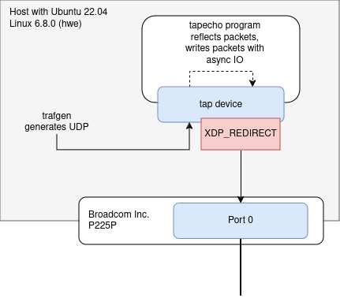

# TX DMA unmap issue

Simple reproducer for an eBPF XDP redirect issue we observe with BroadCom
NetExtreme NICs (bnxt_en driver) that results in DMA unmap warnings.

## The issue

On machines with Broadcom NetExtreme NICs (kernel driver bnxt_en), we observe
DMA unmap warnings when using eBPF XDP programs redirecting from a tap device 
to a bnxt_en NIC. Originally, the issue was observed with tap interfaces used
by QEMU VMs. Running performance tests just sending UDP packets resulted in
constant dma_unmap warnings and very low performance.

The warning constantly logged is:

```
WARNING: CPU: 12 PID: 0 at drivers/iommu/dma-iommu.c:842 __iommu_dma_unmap+0x159/0x170
CPU: 12 PID: 0 Comm: swapper/12 Kdump: loaded Tainted: G        W          6.8.0-48-generic #48~22.04.1-Ubuntu
RIP: 0010:__iommu_dma_unmap+0x159/0x170
Code: a8 00 00 00 00 48 c7 45 b0 00 00 00 00 48 c7 45 c8 00 00 00 00 48 c7 45 a0 ff ff ff ff 4c 89 45 b8 4c 89 45 c0 e9 77 ff ff f
RSP: 0018:ff22d31180c70c98 EFLAGS: 00010206
RAX: 0000000000002000 RBX: 00000000d63fe000 RCX: 0000000000000000
RDX: 0000000000000000 RSI: 0000000000000000 RDI: 0000000000000000
RBP: ff22d31180c70d00 R08: ff22d31180c70cb8 R09: 0000000000000000
R10: 0000000000000000 R11: 0000000000000000 R12: 0000000000001000
R13: ff13544d10645010 R14: ff22d31180c70ca0 R15: ff13544d0b2bac00
FS:  0000000000000000(0000) GS:ff13550907e00000(0000) knlGS:0000000000000000
CS:  0010 DS: 0000 ES: 0000 CR0: 0000000080050033
CR2: 000000c000835010 CR3: 00080002286b2006 CR4: 0000000000f71ef0
PKRU: 55555554
Call Trace:
 <IRQ>
 ? show_regs+0x6d/0x80
 ? __warn+0x89/0x160
 ? __iommu_dma_unmap+0x159/0x170
 ? report_bug+0x17e/0x1b0
 ? handle_bug+0x46/0x90
 ? exc_invalid_op+0x18/0x80
 ? asm_exc_invalid_op+0x1b/0x20
 ? __iommu_dma_unmap+0x159/0x170
 ? __iommu_dma_unmap+0xb3/0x170
 iommu_dma_unmap_page+0x4f/0x100
 dma_unmap_page_attrs+0x52/0x220
 ? srso_alias_return_thunk+0x5/0xfbef5
 ? xdp_return_frame+0x2e/0xd0
 bnxt_tx_int_xdp+0x1b2/0x2e0 [bnxt_en]
 __bnxt_poll_work_done+0x8a/0x1a0 [bnxt_en]
 bnxt_poll+0xd3/0x1e0 [bnxt_en]
 __napi_poll+0x30/0x200
 net_rx_action+0x181/0x2e0
 handle_softirqs+0xd8/0x340
 __irq_exit_rcu+0xd9/0x100
 irq_exit_rcu+0xe/0x20
 common_interrupt+0xa4/0xb0
```

With packets sizes up to 128 bytes, the issue was not present even with high
packet rates (single CPU maxed out). The issue could only be reproduced with
packets longer than 128 byte. Then, even with low packet rates of 
100pps, the issue appeared. The maximum packet rate was decreased considerably 
as well, possibly due to the error handling of the kernel.

The issue was present with 1, 16 or 32 (of 37 possible) queues. Disabling all
offloads did not help.

A workaround is to change the IOMMU mode to pass through mode (`iommu=pt`).

## Hardware

* Broadcom 57414 10/25GbE SFP28 2-port OCP Ethernet Adapter

Firmware: 230.0.157.0/pkg 230.1.116.0

## Kernel versions tested with issue present

Distro used: Ubuntu 22.04
Kernel: 6.8.0-48 (linux-image-generic-hwe-22.04)

Reproducible with in-tree bnxt_en driver and out-of-tree bnxt_en driver by
Broadcom (bnxt_en-1.10.3-231.0.162.0).

## Concept of this reproducer

The issue could be condensed to the following requirements to be reproducible:
* bnxt_en NIC to do XDP_REDIRECTs to
* TAP device to do XDP-REDIRECTs from
* The process owning the TAP device uses asynchronous IO to write to the 
  device's file descriptor.
* Packets must be longer than 128 byte.

Instead of using a QEMU VM to generate and send packets on a TAP device,
a simple program is provided that just reflects packets it receives using
asynchronous IO.

Packets are generated and sent on the TAP device. They are just reflected and
received back on the TAP device were a XDP program redirects them to a bnxt_en
interface.



## How to reproduce

### Software requirements

* [xdp-tools/xdp-bench]( https://github.com/xdp-project/xdp-tools) for 
  XDP_REDIRECTs from tap to bnxt_en interface.
* [netsniff-ng/trafgen](https://github.com/netsniff-ng/netsniff-ng) for 
  generating the packets.
* [tapecho](tapecho) for a minimal TAP device owning program reflecting packets.

Clone and build the `xdp-tools`. `netsniff-ng` is usually available packaged by
distros. Clone this repo and build `tapecho`.

### Run

Assuming the bnxt_en interface is `eth0` the steps after building the tools
above are:


#### Creating the TAP device (tapecho) and runing the echo program

```
# tapecho/tapecho
```

#### Attaching the XDP redirect program

```
# xdp/tools/xdp-bench/xdp-bench redirect tapecho eth0
```

#### Generating and sending packets

Trafgen config can be quite simple. Addresses are not important.

```
# cat trafgen.cfg
{
  udp(sp=dinc(), dp=2222),
  fill(0xFF, 100)
}
```

```
# trafgen -P1 -o tapecho -c trafgen.cfg
```

#### Observe warnings

```
# journalctl -kf
```
